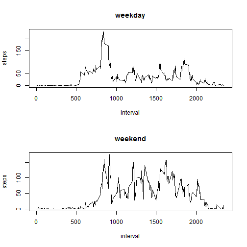

# Reproducible Research: Peer Assessment 1


## Loading and preprocessing the data

```r
data <- read.csv("activity.csv")
data$date <- as.Date(data$date, "%Y-%m-%d")
cleandata <- data[which(data$steps != "NA"), ]
```


## What is mean total number of steps taken per day?
Here's the histogram of the total number of steps taken per day.

```r
data_dailytotal <- aggregate(data[,c("steps"),drop=FALSE], list(date=data$date), sum, na.rm=TRUE)
hist(data_dailytotal$steps, breaks=20, main="", xlab = "Number of steps", ylab = "Frequency")
```

 

```r
mean(data_dailytotal$steps)
```

```
## [1] 9354
```

```r
median(data_dailytotal$steps)
```

```
## [1] 10395
```


## What is the average daily activity pattern?


```r
library(plyr)
average_by_interval <- ddply(cleandata, .(interval), summarise, steps=mean(steps))
plot(average_by_interval$interval, average_by_interval$steps, type="l", 
     col="black",
     xlab="5-minute interval", 
     ylab="Average number of steps taken",
     main="Average daily activity pattern")
```

 

```r
# Which 5-minute interval, on average across all the days in the dataset, contains the maximum number of steps?
average_by_interval[average_by_interval$steps==max(average_by_interval$steps),]
```

```
##     interval steps
## 104      835 206.2
```

```r
colnames(average_by_interval)[2] <- "intervalAvg"
```

## Imputing missing values

```r
#Calculate and report the total number of missing values in the dataset (i.e. the total number of rows with NAs)
sum(is.na(data$steps))
```

```
## [1] 2304
```

```r
# Fill NA's with average for that 5-min interval
merged <- arrange(join(data, average_by_interval), interval)
```

```
## Joining by: interval
```

```r
# Create a new dataset that is equal to the original dataset but with the missing data filled in.
merged$steps[is.na(merged$steps)] <- merged$intervalAvg[is.na(merged$steps)]
# Histogram
new_total_by_day <- ddply(merged, .(date), summarise, steps=sum(steps))
hist(new_total_by_day$steps, main="Number of Steps", 
     xlab="Total number of steps taken each day", col="light blue",)
```

 

```r
# mean and median total number of steps taken per day
mean(new_total_by_day$steps)
```

```
## [1] 10766
```

```r
median(new_total_by_day$steps)
```

```
## [1] 10766
```

```r
total_steps1 <- sum(cleandata$steps)
total_steps2 <- sum(merged$steps)
total_diff <- total_steps2 -total_steps1 []
total_diff
```

```
## [1] 86130
```


## Are there differences in activity patterns between weekdays and weekends?

1. Create a new factor variable in the dataset with two levels --
   "weekday" and "weekend" indicating whether a given date is a
   weekday or weekend day.


```r
daytype <- function(date) {
    if (weekdays(as.Date(date)) %in% c("Saturday", "Sunday","lørdag","søndag")) {
        "weekend"
    } else {
        "weekday"
    }
}
cleandata$daytype <- as.factor(sapply(cleandata$date, daytype))
```

2. Make a panel plot containing a time series plot (i.e. `type = "l"`)
   of the 5-minute interval (x-axis) and the average number of steps
   taken, averaged across all weekday days or weekend days
   (y-axis).

```r
par(mfrow=c(2,1))
for (thedaytypes in c("weekday","weekend")) {
    steps.type <- aggregate(steps ~ interval,
                            data=cleandata,
                            subset=cleandata$daytype==thedaytypes,
                            FUN=mean)
    plot(steps.type, type="l", main=thedaytypes)
}
```

 
